<div align="center">

<!-- ═══════════════════════════════════════════════════════════════════ -->
<!--  🏴‍☠️ HERO SECTION: REAL ONE PIECE CHARACTERS (LUFFY & ZORO ON SUNNY) -->
<!-- ═══════════════════════════════════════════════════════════════════ -->
<a href="https://github.com/abhi06032005">
  
</a>

<br/>

<!-- ═══════════════════════════════════════════════════════════════════ -->
<!--  ⚡ DYNAMIC PIRATE KING TYPING HEADLINE                             -->
<!-- ═══════════════════════════════════════════════════════════════════ -->
<a href="https://git.io/typing-svg">
  
</a>

<br/>

<!-- ═══════════════════════════════════════════════════════════════════ -->
<!--  🌐 BOUNTY & CREW STATUS BADGE MATRIX                               -->
<!-- ═══════════════════════════════════════════════════════════════════ -->
<p align="center">
  <a href="https://linkedin.com/in/abhijeet-nayak-9706bb25a">
    
  </a>
  <a href="mailto:abhijeetnayak478@gmail.com">
    
  </a>
  <a href="https://github.com/abhi06032005">
    
  </a>
  
  <a href="https://github.com/abhi06032005">
    
  </a>
</p>

</div>


<!-- ═══════════════════════════════════════════════════════════════════ -->
<!--  🧭 LOG POSE NAUTICAL QUICK NAVIGATION                              -->
<!-- ═══════════════════════════════════════════════════════════════════ -->
<p align="center">
  <a href="#-about-me--captains-codex"><b>⚓ ABOUT</b></a> •
  <a href="#-tech-stack-matrix"><b>🛠 TECH MATRIX</b></a> •
  <a href="#-marineford-command-center"><b>📊 STATS</b></a> •
  <a href="#-featured-projects"><b>🚀 PROJECTS</b></a> •
  <a href="#-sea-king-snake-matrix"><b>🐍 SNAKE</b></a> •
  <a href="#-career-experience"><b>💼 EXPERIENCE</b></a> •
  <a href="#-hall-of-fame--bounties"><b>🏆 ACHIEVEMENTS</b></a> •
  <a href="#-spotify-coding-beats--drums-of-liberation"><b>🎵 SPOTIFY &amp; BEATS</b></a> •
  <a href="#-lets-connect"><b>🤝 CONNECT</b></a>
</p>


---

## 👨‍💻 About Me & Captain's Codex

<!-- Real Luffy Wanted Poster SVG -->
<p align="center">
  
</p>

```typescript
const abhijeet: DeveloperProfile = {
  role: "Full-Stack Developer & AI Systems Architect",
  education: "BCA — 8.9 CGPA",
  location: "India 🇮🇳",
  stack: ["React", "Next.js", "Node.js", "TypeScript", "PostgreSQL", "Prisma", "Docker"],
  currentlyBuilding: "AI-powered fintech & real-time collaborative apps",
  currentlyLearning: "Distributed systems, RAG pipelines & advanced DSA",
  funFact: "Top 50 finalist / 1100+ teams @ Hackfest 🏆",
  askMeAbout: ["Auth & Payments (HMAC)", "REST/WebSocket APIs (~16ms)", "RAG Pipelines (Qdrant)"],
  reachMe: "abhijeetnayak478@gmail.com",
};
```

### ⚡ Captain's Directives & Production Impact:
- 🔭 Rebuilt & led a **live production website**, cutting load times by **~25–35%**, eliminating **~95%** of content update friction, and boosting session duration **~15–20%**.
- ⚡ Shipped **4 independent full-stack products** spanning auth, HMAC webhook payments, real-time systems & RAG pipelines.
- 🧩 Comfortable owning a feature **end-to-end** — database schema to deployed UI.
- 🏆 **Hackfest Top 50** finalist out of **1,100+ teams**.
- 🌱 Currently exploring distributed architectures & scalable system design.

---

## 🛠 Tech Stack Matrix

<div align="center">

### 👑 Languages & Core Foundation
<a href="https://skillicons.dev">
  
</a>

<br/>

### 🎨 Frontend Architecture
<a href="https://skillicons.dev">
  
</a>

<br/>

### ⚙️ Backend, Databases & Real-Time
<a href="https://skillicons.dev">
  
</a>

<br/>

### ☁️ Cloud, DevOps & Tools
<a href="https://skillicons.dev">
  
</a>

<br/>

### 🛡️ Specialized Tooling & AI Capabilities
<p align="center">
  
  
  
  
  
  
  
  
</p>

</div>

---

## 📊 Marineford Command Center

<div align="center">

<!-- GitHub Stats & Top Languages -->
<a href="https://github.com/abhi06032005">
  
</a>
<a href="https://github.com/abhi06032005">
  
</a>

<br/><br/>

<!-- GitHub Streak Stats -->
<a href="https://github.com/abhi06032005">
  
</a>

<br/><br/>

<!-- GitHub Profile Trophies -->
<a href="https://github.com/abhi06032005">
  
</a>

<br/><br/>

<!-- Activity Graph -->
<a href="https://github.com/abhi06032005">
  
</a>

</div>

---

## 🚀 Featured Projects

### 💰 [FinGuard AI](https://github.com/abhi06032005/finguard-ai) — Full-Stack Financial Research Platform
<p>


</p>

- 🔐 Razorpay subscription/billing engine with **SHA-256 HMAC-signed webhooks** for secure plan upgrades.
- ⏱ Cron-based reconciliation engine that auto-detects & resolves stuck payments.
- 📈 Interactive trading journal & simulator tracking win-rate and portfolio performance.
- ⚡ Automated technical-indicator & divergence detection — signals rendered **< 500ms**, cutting manual analysis time **90%+**.
- 🤖 LLM pipeline turning scraped filings into downloadable PDF summaries — research time cut from hours to **< 30 seconds**.

---

### 📄 [AI-Powered PDF Chat](https://github.com/abhi06032005/pdf-chat-rag) — RAG-Based Document Q&A
<p>


</p>

- 💬 Contextual Q&A over uploaded PDFs using Retrieval-Augmented Generation.
- 🐳 Dockerized Qdrant + BullMQ for scalable vector search & background jobs.
- 🎯 Source-grounded answers that surface the exact passage used to generate each response.

---

### 🎨 [Real-Time Collaboration Platform](https://github.com/abhi06032005/realtime-collab) — Multiplayer Drawing & Chat
<p>


</p>

- ✏️ Real-time multi-user drawing & chat app with **~16ms pointer response**.
- 🔑 Room-code based entry for shared sessions + JWT-secured access.
- 📦 Full-stack monorepo with shared types for streamlined builds.

---

### 🇮🇳 [BharatOrigin](https://github.com/abhi06032005/bharatorigin) — Discovery Platform for Indian Alternatives
<p>


</p>

- 🛍 Helps users discover Indian product alternatives & local artisans via **geo-based search**.
- 📷 Barcode scanning + live search APIs, combining a local dataset with real-time web results.

---

## 🐍 Sea King Snake Matrix

<!-- GitHub Contribution Grid Snake Animation -->
<div align="center">
  
</div>

---

## 💼 Career Experience

```
2025 ────────────────────────────────────────────────── 2026
 │                                                          │
 ├─ Dec 2025 – Mar 2026   SDE Intern @ ITJOBXS
 │                        • Responsive UI across mobile/tablet/desktop
 │                        • Built auth & verification flows
 │                        • Improved UI responsiveness w/ the team
 │
 └─ Jan 2026 – Apr 2026   Freelance @ MSRS, Udupi
                          • Rebuilt the official college website (~25–35% faster loads)
                          • Built a CMS portal cutting content-update time by ~95%
                          • Boosted avg. session duration ~15–20%
                          • Deployed & optimized on Cloudflare
```

---

## 🏆 Hall of Fame & Achievements

<div align="center">

| Status | Achievement | Scope & Scale |
|:---:|:---|:---|
| 🏆 | **Top 50 Finalist** | Hackfest national-level hackathon — out of **1,100+ teams** |
| 📊 | **2nd Rank** | All-India Stock Trading Competition |
| 🧠 | **1st Rank** | Inter-College Quiz — **4,000+ participants** |
| ⭐ | **5-Star SQL Rating** | HackerRank Problem Solving & Databases |
| ✅ | **HackerRank SQL (Intermediate)** | Certified |
| 💻 | **200+ DSA Problems** | Solved across platforms |

</div>

---

## 🎵 Spotify Coding Beats & Drums of Liberation

<div align="center">

<!-- Animated Spotify / Drums of Liberation Music Card -->


<br/><br/>

<!-- Dynamic Developer Quote -->


</div>

---

## 🤝 Let's Connect

<div align="center">

### *"No matter how hard or impossible it is, never lose sight of your goal."* — **Monkey D. Luffy**

<br/>

<a href="https://linkedin.com/in/abhijeet-nayak-9706bb25a">
  
</a>
&nbsp;&nbsp;
<a href="mailto:abhijeetnayak478@gmail.com">
  
</a>
&nbsp;&nbsp;
<a href="https://github.com/abhi06032005">
  
</a>

<br/><br/>

<!-- Animated Waving Sunset Ocean Footer -->


</div>
