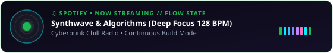

<p align="center">
  
</p>

<p align="center">
  <a href="https://github.com/abhi06032005">
    
  </a>
</p>

<p align="center">
  <a href="https://linkedin.com/in/abhijeet-nayak-9706bb25a" target="_blank">
    
  </a>
  &nbsp;
  <a href="mailto:abhijeetnayak478@gmail.com" target="_blank">
    
  </a>
  &nbsp;
  <a href="https://github.com/abhi06032005" target="_blank">
    
  </a>
  &nbsp;
  
</p>

---

### 💻 System Terminal // Profile Telemetry

<p align="center">
  
</p>

---

### 🚀 Highlights & Production Impact

| Metric / Milestone | Detail & Impact |
| :--- | :--- |
| 🏆 **Hackfest Finalist** | Ranked **Top 50** out of 1,100+ competing engineering teams nationwide |
| ⚡ **Performance Engineering** | Rebuilt official institutional platform achieving **25–35% faster load times** & **95% CMS turnaround reduction** |
| 🧠 **AI & Distributed RAG** | Production vector search pipelines powered by **Qdrant, BullMQ, Groq & Cohere** with sub-30s report synthesis |
| 🎯 **Algorithmic Problem Solving** | **200+ DSA problems solved**, 5-Star HackerRank in SQL & Problem Solving, 1st rank / 4,000+ quiz participants |

---

### 🛠️ Technology Stack & Engineering Arsenal

<div align="center">

#### Languages & Runtimes
<p align="center">
  <a href="https://skillicons.dev">
    
  </a>
</p>

#### Frontend & UI Architecture
<p align="center">
  <a href="https://skillicons.dev">
    
  </a>
</p>

#### Backend, Databases & Event Queues
<p align="center">
  <a href="https://skillicons.dev">
    
  </a>
</p>

#### Cloud, AI Systems & DevOps
<p align="center">
  <a href="https://skillicons.dev">
    
  </a>
</p>

</div>

---

### 🔮 Featured Projects

```
┌── [ 🛡️ FinGuard AI ] ────────────────────────────────────────────────────────┐
│  • Full-stack financial intelligence platform with automated reconciliation  │
│  • Secure Razorpay & SHA-256 HMAC authentication with zero payment drop-offs │
│  • LLM pipeline converting raw filings to insights in under 30 seconds       │
│  • Stack: Next.js, Node.js, PostgreSQL, Prisma, Tailwind CSS, LLMs           │
└──────────────────────────────────────────────────────────────────────────────┘

┌── [ 📄 Contextual PDF RAG System ] ──────────────────────────────────────────┐
│  • Retrieval-Augmented Generation system with multi-document vector search   │
│  • High-throughput context retrieval via Qdrant Vector DB & BullMQ workers   │
│  • Grounded responses with precise passage citations & source verification   │
│  • Stack: Python, Qdrant, Docker, BullMQ, Redis, Groq                        │
└──────────────────────────────────────────────────────────────────────────────┘

┌── [ ⚡ Real-Time Collaboration Canvas ] ─────────────────────────────────────┐
│  • Low-latency multiplayer whiteboard with real-time cursor tracking        │
│  • Sub-16ms WebSocket communication layer with room-based session scaling    │
│  • Room code generation, JWT authentication & persistent canvas state        │
│  • Stack: React, Node.js, WebSockets, Redis, Canvas API                      │
└──────────────────────────────────────────────────────────────────────────────┘
```

---

### 📊 GitHub Telemetry & Activity

<p align="center">
  
  &nbsp;&nbsp;
  
</p>

<p align="center">
  
</p>

<p align="center">
  <a href="https://github.com/ryo-ma/github-profile-trophy">
    
  </a>
</p>

---

### 🎵 In The Flow State

<p align="center">
  
</p>

---

### 🐍 Contribution Stream

<!-- Generated automatically via Platane/snk GitHub Action -->
<p align="center">
  
</p>

<p align="center">
  
</p>
